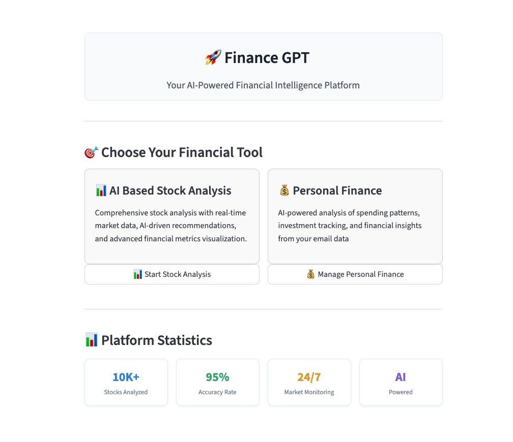
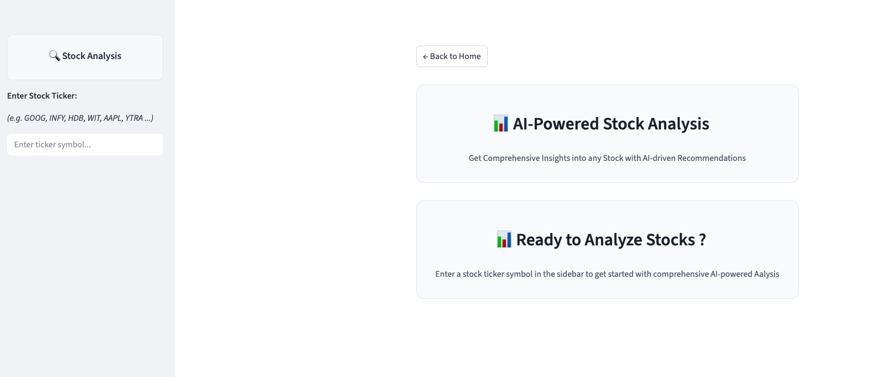
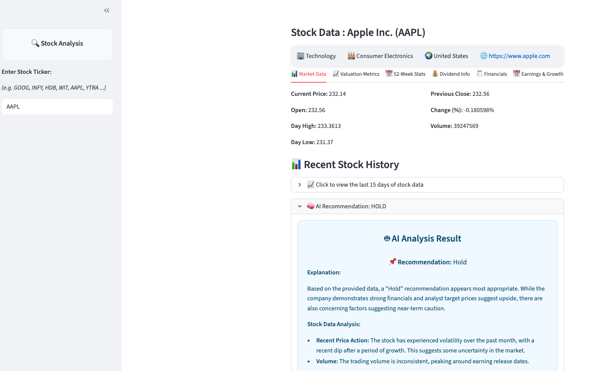
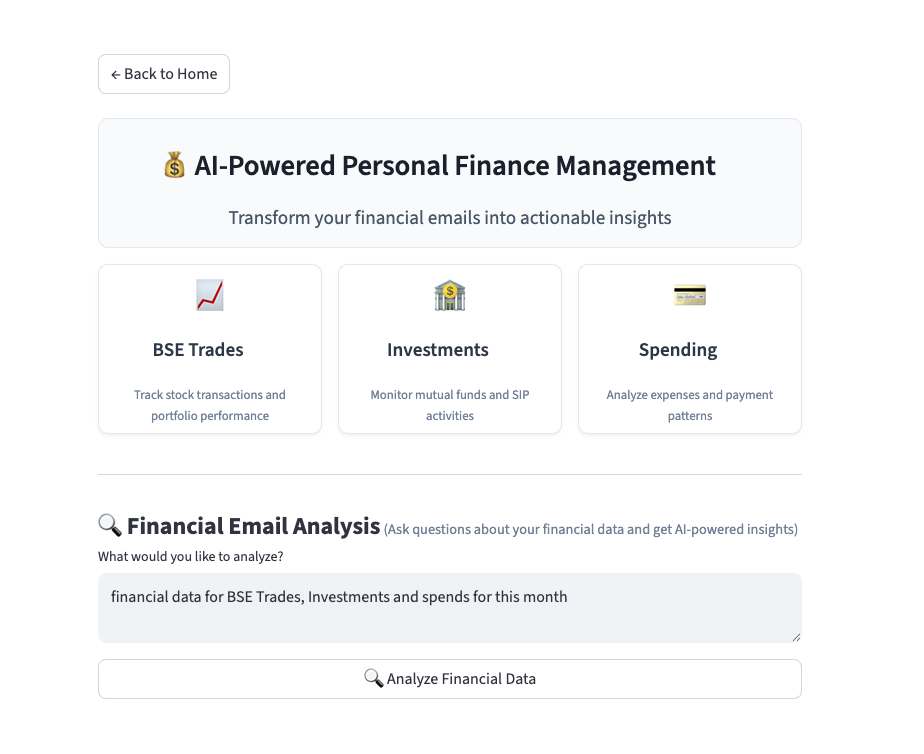
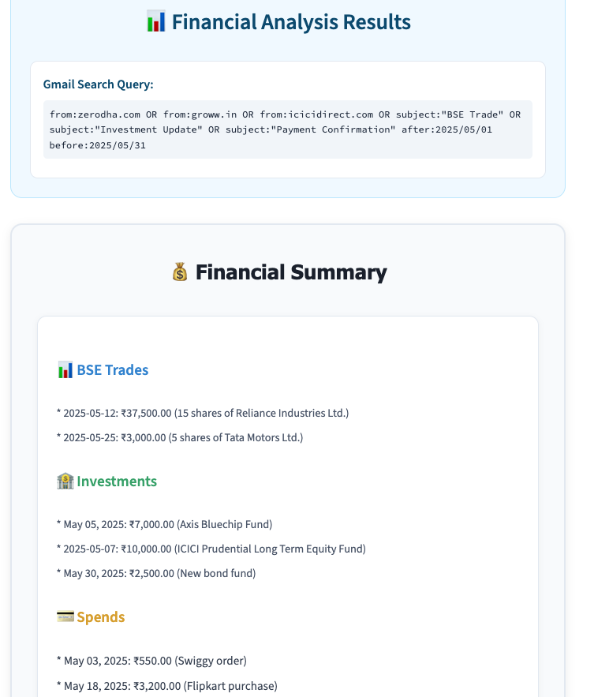

# FinanceGPT - AI-Powered Financial Analysis Platform


A comprehensive Streamlit application that combines AI-powered stock analysis with intelligent personal finance management using Google Gemini AI.

### Description
📊 AI-Powered Personal Finance Management and Stock Recommendation System designed to provide actionable insights such as "Buy" or "Sell" recommendations for stocks. By integrating data from multiple sources, applying advanced machine learning techniques, and presenting a user-friendly interface, this system empowers users to make data-driven investment decisions using data from:

### 💰 Stock Recommendation System
- **Real-time Stock Data**: Fetch and analyze stock information for any ticker
  - Yahoo Finance price/history
  - Alpha Vantage fundamentals
  - News API headlines for sentiment
- **AI Recommendations**: Get intelligent buy/sell recommendations using AI analysis
- **Technical Indicators**: Comprehensive stock analysis with visual charts
- **Market Insights**: AI-generated insights and market sentiment analysis


### 💰 Personal Finance Management
- **Email Analysis**: Automatically analyze financial emails using Gmail integration
- **Transaction Categorization**: Smart categorization of BSE trades, investments, and expenses
- **Financial Summaries**: AI-generated summaries with consistent date formatting
- **Spend Tracking**: Automatic detection and categorization of spending patterns


## 🏗️ Project Structure

```
financegpt/
├── app/                        # Application Layer
│   ├── __init__.py            # Python package initialization
│   ├── main.py                # Main Streamlit application entry point
│   ├── stock_analysis.py      # Stock analysis functionality and UI
│   └── personal_finance.py    # Personal finance management and AI analysis
├── core/                       # Business Logic Layer
│   ├── __init__.py            # Python package initialization
│   ├── agent_handler.py       # Stock analysis AI agent orchestration
│   ├── gmail_agent.py         # Gmail integration and financial data analysis
│   ├── sentiment_analysis.py  # News sentiment analysis utilities
│   └── utils.py               # Common utility functions
├── services/                   # External Data Layer
│   ├── __init__.py            # Python package initialization
│   └── data_fetcher.py        # External data fetching (Yahoo Finance, Alpha Vantage, News API)
├── config/                     # Configuration Management
│   └── __init__.py            # Configuration loading and management
├── tests/                      # Testing Suite
│   ├── conftest.py            # Test configuration and fixtures
│   ├── test_agent_handler.py  # Agent handler tests
│   ├── test_data_fetcher.py   # Data fetcher tests
│   └── test_sentiment.py      # Sentiment analysis tests
├── .git/                       # Git version control
├── .gitignore                  # Git ignore rules
├── .DS_Store                   # macOS system file
├── freeze_requirements.txt     # Frozen Python dependencies (exact versions)
├── requirements.txt            # Python dependencies
└── README.md                   # Project documentation
```


### 🔧 **Environment Variables**
Create a `.env` at project root (or export in your shell):
```dotenv
GEMINI_API_KEY=your_gemini_key
NEWS_API_KEY=your_newsapi_key
ALPHAVANTAGE_API_KEY=your_alpha_vantage_key
```

## 📊 Application Snippets:






## 🛠️ Installation

### Prerequisites
- Python 3.8+
- Google Gemini API key
- Gmail API credentials (for email analysis)

### Setup
1. **Clone the repository**
   ```bash
   git clone <repository-url>
   cd financegpt
   ```

2. **Install dependencies**
   ```bash
   pip install -r requirements.txt
   ```

3. **Environment Configuration**
   Create a `.env` file in the root directory:
   ```env
    GEMINI_API_KEY=your_gemini_key
    NEWS_API_KEY=your_newsapi_key
    ALPHAVANTAGE_API_KEY=your_alpha_vantage_key
   ```

4. **Run the application**
   ```bash
   streamlit run app/main.py
   ```

## 📱 Usage

### Landing Page
The application opens with a dynamic landing page featuring:
- **AI Powered Stock Analysis**: Navigate to stock analysis tools
- **Manage Personal Finance with AI**: Access personal finance features
- **Platform Statistics**: View key metrics and performance indicators

### Stock Analysis
1. Navigate to "Start Stock Analysis"
2. Enter a stock ticker symbol
3. View real-time stock data and charts
4. Get AI-powered recommendations and insights

### Personal Finance
1. Navigate to "Manage Personal Finance"
2. Enter your financial query
3. AI analyzes your financial emails and transactions
4. View categorized summaries:
   - **BSE Trades**: Stock trading activities
   - **Investments**: Fund investments and SIPs
   - **Spends**: Expense tracking and categorization

## 🔑 Key Features

### Smart Detection
- **BSE Trades**: Detects keywords like `shares`, `trade`, `buy`, `sell`
- **Investments**: Identifies `fund`, `investment`, `SIP` keywords
- **Spends**: Recognizes `swiggy`, `flipkart`, `payment`, `bill` patterns

### Data Consistency
- **Unified Format**: All sections display data consistently
- **Date Standardization**: Consistent date formatting across all transactions
- **Amount Formatting**: Proper rupee symbol and comma formatting

### Error Handling
- **Duplicate Prevention**: Prevents duplicate section headers
- **Fallback Processing**: Graceful handling of malformed data
- **Clean Output**: Professional appearance without debug information

## 🚀 Future Enhancements

- [ ] Real-time market data integration
- [ ] Portfolio tracking and performance metrics
- [ ] Advanced charting and technical analysis
- [ ] Multi-currency support
- [ ] Export functionality for reports
- [ ] Mobile app development

## 🤝 Contributing

1. Fork the repository
2. Create a feature branch (`git checkout -b feature/amazing-feature`)
3. Commit your changes (`git commit -m 'Add amazing feature'`)
4. Push to the branch (`git push origin feature/amazing-feature`)
5. Open a Pull Request

## 📄 License

This project is licensed under the MIT License - see the [LICENSE](LICENSE) file for details.

## 🆘 Support

For support and questions:
- Create an issue in the repository
- Contact the development team
- Check the documentation for common solutions

## 🙏 Acknowledgments

- Google Gemini AI for intelligent financial analysis
- Streamlit for the web application framework
- Open-source community for various libraries and tools

---
**FinanceGPT** - Making financial analysis intelligent and accessible! 🚀✨

### Disclaimer
This project is for educational purposes only and does not constitute financial advice.  
All recommendations and insights generated by this system are based on publicly available data and AI models, which may have limitations and inaccuracies.  
Users should not rely solely on this tool for making investment decisions.  
Always consult with a qualified financial advisor and conduct your own research before making any financial transactions.  
The authors and contributors are not responsible for any losses or damages resulting from the use of this software.


