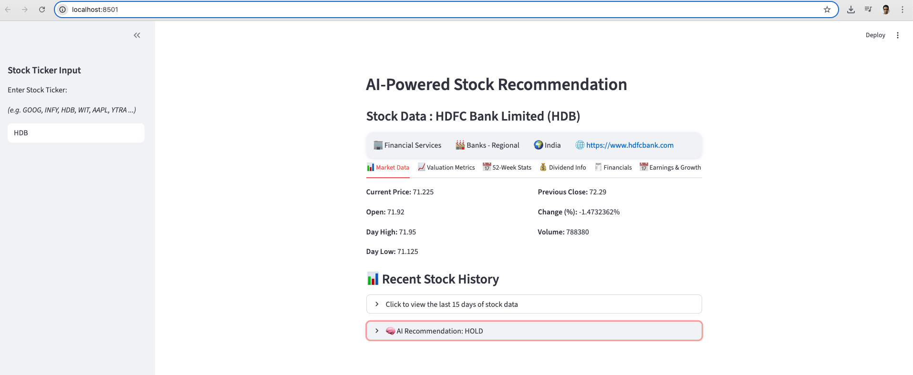
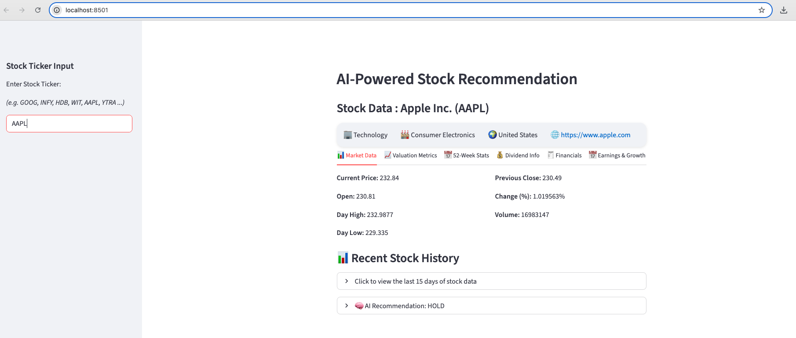

## AI-powered Stock Recommendation System


This project is an AI-powered Stock Recommendation System designed to provide actionable insights such as "Buy" or "Sell" recommendations for stocks. By integrating data from multiple sources, applying advanced machine learning techniques, and presenting a user-friendly interface, this system empowers users to make data-driven investment decisions using data from:
- Yahoo Finance price/history
- Alpha Vantage fundamentals
- News API headlines and simple sentiment
- Gemini (google-generativeai) for the final recommendation text

---

### Description
This project aggregates real-time market data and news to help users make informed decisions about individual stocks. It fetches recent price history and key metrics from Yahoo Finance, optional company fundamentals from Alpha Vantage, and relevant news headlines via NewsAPI. These inputs are composed into an LLM prompt (Gemini) to produce a concise recommendation (Buy/Sell/Hold) along with brief reasoning. A simple sentiment utility is included to score news tone. The Streamlit UI lets you enter a ticker, view key stats and recent history, and see the generated recommendation.

---

### Project Structure
```
Stock_Recommender/
  app/
    __init__.py
    main.py                 # Streamlit entrypoint
  core/
    __init__.py
    agent_handler.py        # Orchestrates data, builds LLM prompt
    sentiment_analysis.py   # Sentiment utilities
    utils.py
  services/
    __init__.py
    data_fetcher.py         # yfinance, Alpha Vantage, News API
  config/
    __init__.py             # place config.yaml if needed
  tests/
    conftest.py             # stubs external libs, adds project root to sys.path
    test_agent_handler.py
    test_data_fetcher.py
    test_sentiment.py
  requirements.txt
  .gitignore
  README.md
```

---

### Environment Variables
Create a `.env` at project root (or export in your shell):
```dotenv
GEMINI_API_KEY=your_gemini_key
NEWS_API_KEY=your_newsapi_key
ALPHAVANTAGE_API_KEY=your_alpha_vantage_key
```

---

### Run the App
Run from the project root so imports resolve correctly:
```bash
streamlit run app/main.py
```

---

### How to Use
- Open the app in your browser after launching.
- In the left sidebar, enter a stock ticker symbol (e.g., `INFY`, `TSLA`, `AAPL`).
- The app will display:
  - Recent price history and key metrics (price, P/E, volume, 52-week range)
  - A generated recommendation (Buy/Sell/Hold) and brief explanation
- Adjust the ticker as needed to analyze another stock.
- Gain confidence in decision-making by checking sentiment analysis from news

---

## 🖼️ Screenshots




### Running Tests
```bash
pytest -q
# Verbose with per-test status
pytest -vv -rA
# Single file/test
pytest tests/test_agent_handler.py -vv
pytest tests/test_agent_handler.py::test_generate_recommendation_happy_path -vv
```

---

### Disclaimer
This project is for educational purposes only and does not constitute financial advice.  
All recommendations and insights generated by this system are based on publicly available data and AI models, which may have limitations and inaccuracies.  
Users should not rely solely on this tool for making investment decisions.  
Always consult with a qualified financial advisor and conduct your own research before making any financial transactions.  
The authors and contributors are not responsible for any losses or damages resulting from the use of this software.


